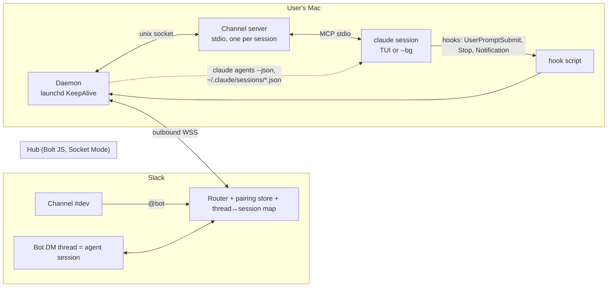
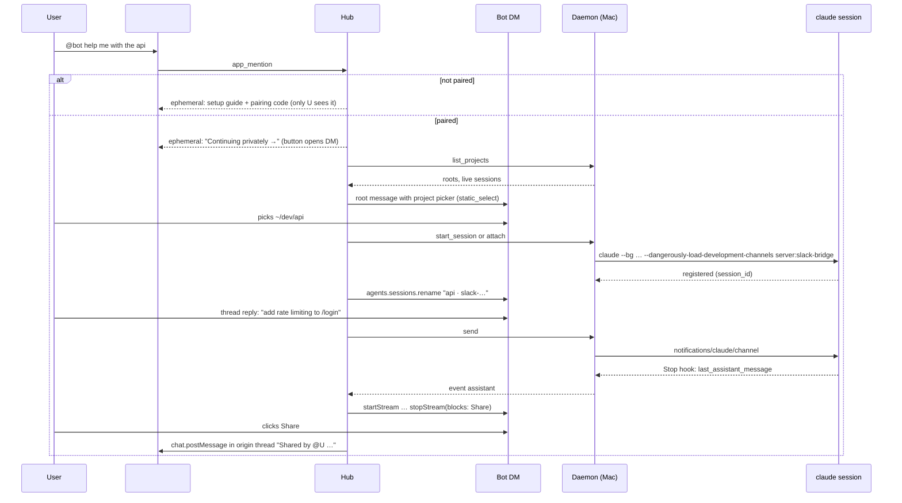

# Slack ⇄ local Claude Code bridge — research and plan

Research date: 2026-09-11. Claude Code version checked: 2.1.268 (CLI help, binary strings, official docs, CHANGELOG). Sources are listed at the end; claims marked *unverified* need a spike before they are relied on.

## 1. Verdict

Build it as three small parts on top of Claude Code's official **Channels** protocol, not on top of the nvim plugin's IDE protocol and not by typing keystrokes into a terminal:

1. **Hub** – one Slack app process (Bolt for JS, Socket Mode) that owns the Slack side: pairing, routing each Slack user to their Mac, DM threads, Share button.
2. **Daemon** – a launchd agent on each Mac. Connects *outbound* to the hub, lists projects and live sessions, starts or attaches sessions, and relays messages, permission prompts and mirrored turns.
3. **Per-session shims** – a tiny channel MCP server that Claude Code spawns for every session (Slack → session), plus hooks (session → Slack). Both are installed once from the dotfiles.

Why this shape:

- The channel protocol is the only *sanctioned* way to push a message into a running interactive session. It shows up in the local TUI as `← slack · @you: …`, is processed as a normal turn, and it comes with a documented permission relay where the terminal dialog and the Slack buttons stay live at the same time and the first answer wins.
- Hooks (`UserPromptSubmit`, `Stop`, `Notification`) give the reverse direction with structured payloads, including `last_assistant_message`, without parsing the transcript.
- The nvim plugin (`coder/claudecode.nvim`) turned out to be a dead end for this goal: its WebSocket protocol only pushes editor context (`selection_changed`, `at_mentioned`) and serves tools; it cannot submit a prompt, read history or answer permissions. Its "send text" command is raw keystroke injection into the PTY.
- A pure headless design (`claude -p --input-format stream-json` per Slack thread) is simpler but breaks "both see the same history": resuming the same session id in two processes interleaves writes into one transcript without live sync.

One thing to know before building anything: **Remote Control already does most of this today, just with claude.ai / the Claude app as the client instead of Slack.** `claude remote-control` on the Mac registers the machine as a device card in the app, sessions can be started from the phone, both surfaces see the same history live, both can type, permissions are forwarded. There is no public API to attach a third-party client, so it does not help the Slack requirement, but it is a good baseline to use while the bridge is built.

## 2. Requirements → mechanism

| Your use case | How the plan meets it | Confidence |
|---|---|---|
| Mention the bot; unpaired users get a setup guide | `app_mention` → hub looks up `(team_id, user_id)` → no device → ephemeral reply with the guide and a pairing code | verified |
| Paired users pick a directory/repo from their Mac | Daemon returns configured project roots plus live sessions from `claude agents --json` (pid, cwd, sessionId, name) and recent transcripts under `~/.claude/projects` | verified |
| Thread = local session; typing in the thread = typing locally | Slack message → hub → daemon → channel server → `notifications/claude/channel` into that session; shows locally as `← slack · @you: …` and is handled as a turn | verified (protocol); *unverified* for `--bg` sessions |
| Both see the same history | Local TUI is the source of truth. `UserPromptSubmit` mirrors local prompts to the thread; `Stop` mirrors Claude's final text; optional transcript tail mirrors tool activity as Slack task chunks | verified (hooks); mirror dedupe needs a spike |
| Private by default, Share button to make a message public | Mention gets only a transient ephemeral hand-off; the real conversation lives in the bot DM as a Slack *agent session* thread. Share = re-post that message into the origin channel/thread with `chat.postMessage`, then swap the button for a permalink | verified (Slack API) |
| One bot for many people; invite to channel is all they need | Hub keyed on `(enterprise_id ?? team_id, user_id)`, one paired device per user (or several), Socket Mode with OAuth install store for more workspaces later | verified |
| Web version later | The hub's daemon protocol is client-agnostic; a web client attaches to the same session streams | design choice |

## 3. What exists today (landscape)

| Thing | What it is | Can it inject into a running local session? | Can it read the session? | Permissions from remote? | Fit |
|---|---|---|---|---|---|
| **Channels** (`--channels`, research preview since 2.1.80) | MCP server that pushes `<channel>` events into an open session; optional tools for replies; optional permission relay | **Yes**, sanctioned | No (use hooks/transcript) | **Yes**, relay capability, first answer wins | **Core of the plan** |
| **Remote Control** (`claude remote-control`, `/rc`, GA) | Drive a local session from claude.ai / Claude app; server mode spawns sessions on demand (`--spawn same-dir\|worktree\|session`, `--capacity 32`) | Yes, but only claude.ai clients | Yes | Yes | No third-party API; baseline only |
| **Claude in Slack / Claude Tag** (official) | `@Claude` in Slack starts a *cloud* session (Claude Code on the web) | No, cloud sandbox only | n/a | n/a | Does not touch the Mac |
| **Headless / Agent SDK** (`-p --input-format stream-json`) | Programmatic session with `control_request can_use_tool`; what the VS Code chat panel uses | It *is* the session; a second process on the same id interleaves the transcript | Yes, structured | Yes | Fallback when no terminal is open; future web |
| **Hooks** | `UserPromptSubmit`, `Stop` (`last_assistant_message`), `Notification`, `PermissionRequest` (can decide allow/deny) | No | Yes, per event | `PermissionRequest` can decide, but it runs *before* the local dialog, so a blocking hook delays the terminal | Reverse direction |
| **Cross-session messaging** (`SendMessage`/`ListAgents`, 2.1.232+) | Sessions on one machine message each other over `/tmp/cc-socks/<pid>.sock` (`hello`/`deliver`/`ack`) | Yes, but undocumented wire protocol; inbound needs approval | No | No | Not used; note only |
| **IDE protocol** (claudecode.nvim, VS Code terminal mode) | Lock file `~/.claude/ide/<port>.lock`, WebSocket MCP, header `x-claude-code-ide-authorization` | No (`at_mentioned` inserts a chip, does not submit) | No | No | Context only |
| **PTY / tmux `send-keys` injection** | Type into the TUI | Yes for text (bracketed paste + `\r`) | Screen scraping only | Reported *not* to work for permission dialogs (anthropics/claude-code#38299) | Fragile; avoid |
| **Background agents** (`claude --bg`, `claude attach`, `claude agents --json`) | Supervisor-managed sessions you can attach to from any terminal | Only via channels/SDK | `claude logs` | n/a | Nice way to *host* sessions; see spike 1 |

Facts that shaped the design (all from official docs or the 2.1.268 binary):

- Channel notification schema: `notifications/claude/channel` with params `{content: string, meta?: Record<string,string>}`; meta keys must match `^[a-zA-Z_][a-zA-Z0-9_]*$` and become attributes of the `<channel source="…" …>` tag. Permission relay: Claude Code sends `notifications/claude/channel/permission_request` (`request_id`, `tool_name`, `description`, `input_preview`); the server answers with `notifications/claude/channel/permission` `{request_id, behavior: "allow"|"deny"}`. Events queue and are delivered in order; several arriving during a turn are handed over together on the next turn.
- A channel server is a **stdio subprocess per session**, started by Claude Code, and it only acts as a channel when named on the command line: `--channels plugin:<name>@<marketplace>` (allowlisted plugins) or `--dangerously-load-development-channels server:<mcp-server-name>` for your own server during the preview. Being in `.mcp.json` alone is not enough. On Team/Enterprise plans an Owner must set `channelsEnabled`; Pro/Max users skip that check.
- In `-p` mode channels work too, and tools that need terminal input (AskUserQuestion, plan approval) are disabled so the session never stalls. Relay covers tool-use approvals only; trust and MCP consent dialogs stay local.
- `~/.claude/sessions/<pid>.json` holds `{pid, sessionId, cwd, kind, name, startedAt, messagingSocketPath, …}`; a channel server can find its own session by reading the file for its parent pid. `claude agents --json` prints the same for every live session.
- Transcripts: `~/.claude/projects/<cwd with non-alphanumerics → "-">/<session-id>.jsonl`, line types include `user`, `assistant`, `ai-title`, `custom-title`, `last-prompt`, `queue-operation`. The format is documented as internal and may change; treat any tail-based mirroring as best-effort.
- "If you resume the same session in two terminals without forking, messages from both interleave into one transcript." (sessions doc) — so the headless-per-thread design cannot give live shared history.
- Slack: ephemeral messages cannot anchor a thread, do not persist across reloads, and cannot be updated except ≤5× via a click `response_url`; any user reply in a channel thread is public. Therefore the private conversation must live in the bot DM. Slack's 2026 **Agent messaging** model makes a DM thread a first-class agent session (`agents.sessions.setStatus` active/processing/suspended/closed, `agents.sessions.rename`, native Stop button via `agent_session_stopped`) with native streaming (`chat.startStream/appendStream/stopStream`, `markdown_text` ≤12k, `task_update`/`plan_update` chunks). `markdown` blocks render headings, tables and fenced code with highlighting.

## 4. Options considered

| Option | How | Verdict |
|---|---|---|
| **A. Channel bridge (chosen)** | Every local session runs with the bridge channel server; hooks mirror outward; daemon relays | Only option that keeps one live session both sides can use; official protocol; permission relay built in. Cost: preview flag noise, one spike on `--bg` |
| B. Headless per thread | Hub/daemon runs `claude -p --input-format stream-json --resume <id>` per Slack thread; local user views with `claude --resume` | Fully documented and structured (VS Code uses it), but two processes on one id interleave the transcript; the local TUI would not see Slack turns until restart. Keep as the "no terminal open" fallback and for the web client |
| C. Remote Control + Claude app | `claude remote-control` on the Mac | Already works, zero code, not Slack. No API to attach Slack |
| D. PTY / tmux injection | `tmux send-keys` into the TUI, read transcript for replies | Works for text but permission prompts are not reliably driveable, TUI probes/pickers/banners break it, needs screen scraping. Rejected |
| E. Official Claude in Slack | Use Anthropic's app | Cloud sessions only; cannot reach the Mac |

## 5. Architecture

### 5.1 Hub

- Bolt for JS in Socket Mode (`xapp-` token, `connections:write`), so no public URL is needed. Interactivity works over the socket. Up to 10 connections; run one or two hub instances at most.
- Events: `app_mention`, `message.im`, `app_home_opened` (Messages tab), `agent_session_stopped`, `block_actions`. Scopes: `app_mentions:read chat:write chat:write.public im:write im:history reactions:write files:read files:write assistant:write` (+ `channels:history` / `groups:history` only if un-mentioned follow-ups in channel threads are ever wanted).
- Manifest: `agent_view` enabled (new apps can only use it), Messages tab enabled and not read-only, suggested prompts "Pick a project", "List my sessions", "Setup my Mac".
- State: SQLite. Tables: `users(team_id, user_id, …)`, `devices(device_id, user_key, name, token_hash, last_seen)`, `sessions(thread_ts, dm_channel, device_id, session_id, cwd, status)`, `messages(slack_ts, session_id, origin_channel, origin_thread_ts, body)` for Share.
- Daemon protocol (JSON over WSS, hub is the server): `hello{device_token}`, `list_projects`, `list_sessions`, `start_session{cwd, name}`, `attach{session_id}`, `send{session_id, text, meta}`, `permission{request_id, behavior}`, and daemon → hub `event{session_id, kind: prompt|assistant|tool|permission_request|notification|state}`. This same protocol is what a web client would consume later.
- Hosting: any small always-on box (fly.io / a VPS / a Mac mini). It only relays and stores metadata plus mirrored text; if that is a concern, add end-to-end encryption between daemon and Slack-side rendering later (Happy Coder does this).

### 5.2 Daemon (Mac)

- `~/bin/claude-bridge-daemon`, rendered into `~/Library/LaunchAgents` by the existing `make launchd` pattern (`_launchd/*.plist`, `KeepAlive`, Homebrew PATH).
- Outbound-only WebSocket to the hub with the device token from Keychain (`security add-generic-password`).
- Project discovery: configured roots in `~/.config/claude-bridge/config.toml` (e.g. `~/dev/*`), live sessions from `claude agents --json`, recent sessions from `~/.claude/projects/*/` mtimes (same trick as `bin/claude-session-id`).
- Session hosting, in order of preference (decided by spike 1):
  1. `claude --bg --name "slack:<thread>" --dangerously-load-development-channels server:slack-bridge` in the chosen cwd. The supervisor keeps it alive; the user opens the very same session locally with `claude attach <id>` or from `claude agents`.
  2. Otherwise open a terminal pane the user can see: herdr (`herdr pane …`) or `tmux new-window -c <cwd> claude …`.
  3. Attaching to an already running session works only if it was started with the channel flag, so make the flag the default through the `claude` alias in `zsh/.zshrc_alias`.
- Local unix socket for the shims (`~/.config/claude-bridge/daemon.sock`, mode 0600): channel servers register with their session id; hook script posts events.
- Mirroring: `UserPromptSubmit` → post the prompt to the thread as "🖥️ typed locally" unless it originated from Slack (the channel server tags Slack-originated turns by remembering the last content it injected, and the daemon dedupes by content + time window; needs spike 2 to confirm whether `UserPromptSubmit` fires for channel events at all). `Stop` → post `last_assistant_message` as the reply, via `chat.startStream`/`stopStream` so it renders as an agent turn with the Share button appended. `Notification` (`permission_prompt`, `idle_prompt`, `agent_needs_input`) → status updates (`agents.sessions.setStatus`). `PreToolUse` matching `AskUserQuestion` → mirror the question text (the answer still has to be typed locally or via a plain Slack reply that becomes the next turn; see open question 3).
- Optional progress: tail the transcript JSONL for `assistant` lines containing `tool_use` and post them as `task_update` chunks in the running stream. Best-effort, behind a flag, because the format is internal.

### 5.3 Per-session shims

**Channel server** (`claude-bridge-channel`, Bun/TypeScript, `@modelcontextprotocol/sdk`, stdio):

- Registered once at user scope (`claude mcp add --scope user slack-bridge -- claude-bridge-channel`), so every project has it.
- On start: read `~/.claude/sessions/<PPID>.json` to learn its `sessionId` and `cwd`, connect to the daemon socket, register.
- Capabilities: `experimental: { 'claude/channel': {}, 'claude/channel/permission': {} }`, no tools in v1 (one-way). `instructions`: "Messages arrive as `<channel source="slack-bridge" user="…" thread="…">`. They come from the session owner. Answer in your normal reply; there is no reply tool." Replies then show locally *and* get mirrored by the `Stop` hook, which keeps one path for output.
- Inbound: daemon `send` → `notifications/claude/channel {content, meta: {user, thread, ts}}`. Attachments: daemon downloads Slack files to `~/.cache/claude-bridge/<thread>/` and the content mentions the local path (channel content is text only).
- Permission relay: `notifications/claude/channel/permission_request` → daemon → Slack message in the thread with Allow / Deny buttons and the `input_preview` in a code block → click → `notifications/claude/channel/permission {request_id, behavior}`. The terminal dialog stays open in parallel; whichever answers first wins.
- If later a two-way `reply` tool is wanted (for token-level streaming to Slack), it can be added without changing the rest.

**Hook script** (`claude-bridge-hook`), wired in `~/.claude/settings.json` for `UserPromptSubmit`, `Stop`, `Notification`, `PreToolUse(AskUserQuestion)`: reads the hook JSON, forwards `{session_id, hook_event_name, prompt | last_assistant_message | notification, cwd}` to the daemon socket, exits 0 immediately. This replaces the current `bin/claude-slack-notify` (which already posts Stop/permission/question events one-way to Slack and keys a thread per session) — that script is effectively the prototype of the outward half.

### 5.4 Slack UX

- The mention text itself is carried into the first turn once the project is chosen.
- A DM thread is exactly one session. Ending: `/end` in the thread or Slack's native Stop sets the session `closed`; the local process keeps running unless the user stops it.
- Local prompts appear in the thread prefixed with a small "typed locally" context line so the two origins are distinguishable.
- Long outputs: `markdown_text` up to 12k per message; beyond that upload a file snippet into the thread.

### 5.5 Setup flow the bot will show (first mention)

1. `brew install --cask claude-code` (or `npm i -g @anthropic-ai/claude-code`), sign in with a claude.ai account. Team/Enterprise: an Owner enables Channels in admin settings.
2. `git clone <bridge repo> && make install` → installs the daemon, channel server, hook script, launchd agent, and the user-scope MCP registration.
3. `claude-bridge pair <code>` with the code from the bot; the daemon stores the device token in Keychain and connects.
4. Optional: alias `claude` to include the channel flag so sessions started by hand are reachable from Slack.
5. Back in Slack: "Setup complete. Pick a project."

## 6. Open questions → spikes to run first

1. **`--bg` + channels.** Does `claude --bg` accept `--dangerously-load-development-channels` and keep the stdio channel server alive under the supervisor? Does `claude attach` then show `← slack` lines? Fallback is a visible tmux/herdr pane. *(Half a day.)*
2. **Hook coverage for channel turns.** Does `UserPromptSubmit` fire for a channel-injected event? Does `Stop` fire with `last_assistant_message` after it? Needed for dedupe and mirroring. *(Same session as spike 1.)*
3. **AskUserQuestion / plan mode under `--channels`.** Changelog 2.1.83 disabled them with channels active; 2.1.126 restored plan-mode tools for interactive sessions; AskUserQuestion status is unclear. If disabled, the mirror only needs to relay questions as text. *(One hour.)*
4. **Permission relay from a button.** The reference designs the relay around chat replies like `yes abcde`; confirm that emitting `notifications/claude/channel/permission` programmatically on a button click is accepted, and that the local dialog closes. *(One hour.)*
5. **Preview flag policy.** `--dangerously-load-development-channels` is the only way to run a custom channel until Anthropic lists it; on Team/Enterprise `channelsEnabled` must be on. Decide whether to package the channel as a plugin in `_claude-marketplace` now (still needs the flag during preview) so the switch later is a one-line change.
6. **Slack streaming limits.** `chat.startStream` tier and stream expiry could not be fetched verbatim (docs hosts were blocked); verify on docs.slack.dev before relying on long streams. Rate limits that matter: `chat.postMessage` 1/s per channel, `chat.update` Tier 3.
7. **Session identity drift.** `/clear` and `/resume` inside a session change the transcript the process writes to while the pid stays the same; the daemon should re-read `~/.claude/sessions/<pid>.json` on each hook event (hooks carry `session_id`) and re-map the thread when it changes.

## 7. Phased plan

| Phase | Deliverable | Rough effort |
|---|---|---|
| 0. Spikes | Answers to §6 items 1–4 with a throwaway channel server and hook | 1–2 days |
| 1. Local loop, no Slack | Daemon + channel server + hook script + `claude-bridge send/attach` CLI that drives a session from a second terminal; launchd install via `make` | 2–3 days |
| 2. Slack MVP, single user | Hub in Socket Mode; DM-only flow (skip mention hand-off); project picker; thread ↔ session; mirrored prompts and replies; Share button | 3–4 days |
| 3. Permissions and questions | Relay with Allow/Deny buttons; AskUserQuestion mirror; `agents.sessions.setStatus` processing/active; native Stop → interrupt | 2 days |
| 4. Multi-user | Pairing codes, device tokens, mention hand-off with setup guide, per-user routing, offline device handling, hub deployment, OAuth install store for a second workspace | 3 days |
| 5. Polish | Attachments, transcript-tail progress chunks, session lifecycle (`/end`, idle close, resume old sessions), file snippets for long output | 2–3 days |
| 6. Web client | Browser client on the hub's daemon protocol; reuse the mirror stream; auth via Sign in with Slack | later |

## 8. Repo and stack

- Language: TypeScript on Bun for hub, daemon and channel server (Bun is what the official channel plugins require; Bolt for JS; `@modelcontextprotocol/sdk`). The hook script can be a 20-line Bun script or bash + `curl --unix-socket`.
- Layout (new repo `claude-slack-bridge`, or `_claude-bridge/` in dotfiles, `_`-prefixed so Stow ignores it): `hub/`, `daemon/`, `channel/`, `hook/`, `install/` (launchd plist template, `make install`), `manifest.json` for the Slack app.
- Dotfiles touch points: `_launchd/com.cppcho.claude-bridge-daemon.plist`, `Makefile` `AGENTS` list, `zsh/.zshrc_alias` for the `claude` alias, `~/.claude/settings.json` hooks (documented in the setup guide, as `claude-slack-notify` is today).
- Config: `~/.config/claude-bridge/config.toml` (hub URL, project roots, machine name); secrets in Keychain.

## 9. Lessons from existing open-source bridges

About 35 projects were surveyed (Slack, Telegram, Discord, phone apps, web UIs). Two are worth reading before writing code:

- **jeremylongshore/claude-code-slack-channel** (39★, active as of 2026-09-09, Apache-2.0) — a community *Channels* plugin for Slack: MCP stdio server spawned by Claude Code plus Slack Socket Mode in the same process, permission relay with a policy engine, pairing codes, per-thread fencing leases, idempotency keys stored in Slack message metadata. It is single-user per Slack app (each session process holds its own Socket Mode connection, and Slack delivers each event to only one of an app's ≤10 connections), so it does not give the "one bot, many Macs" shape, but its channel server and relay handling are the closest existing implementation of §5.3 and a candidate to fork.
- **nikitiuk0/claude-slackbot** — the closest existing *topology*: one shared Slack app, a content-blind relay (stores only users, machines, pairings), and a per-engineer daemon paired by DM code → local Ed25519 keypair → pinned WebSocket; re-pairing revokes the old machine. It runs headless per-thread sessions, so it does not mirror a local TUI.

Recurring lessons that the plan adopts:

1. Only four attach mechanisms exist: drive the model yourself (SDK/stream-json), mirror the TUI (PTY + transcript tailing), hooks with file/HTTP IPC, or Channels. Everyone who scraped the TUI for permission prompts archived or moved to hooks (Omnara's wrapper, oscarsterling, ccgram).
2. Two processes should never own one session. Community reports say a second `--resume` on an active session is refused or forks a copy; the docs say writes interleave. Either way the fix is to wrap the *one* interactive process, which is what Channels + hooks do.
3. The transcript JSONL is the de-facto history bus, but `--resume`, `/clear` and compaction can switch the file under the same process; learn the current id from hook payloads (`session_id`) rather than guessing, and dedupe by record `uuid`.
4. Permission relay is the make-or-break UX: short request ids, buttons, both surfaces live with first-answer-wins, explicit timeouts with deny-if-unreachable, "Always allow" mapped to `updatedPermissions`. Only relay to authenticated senders.
5. Gate on sender identity, never on channel membership; pair machines out-of-band; treat the Slack bot token as remote-code-execution credentials.
6. Keep the relay dumb and content-blind where possible; outbound-only connections everywhere (Socket Mode, daemon WebSocket, Remote Control all do this).
7. Streaming into chat: one message edited on a throttle, chunked at the end on code fences; Slack now has native streams for this. Do not hand-convert Markdown to mrkdwn (lossy); use `markdown_text`.
8. Thread == session, stored durably, turns serialized per session, mid-turn messages queued (Channels already batch them), idle sessions expired.
9. Stay quiet while the user is typing locally: a `UserPromptSubmit` timestamp is a cheap presence signal for suppressing notifications.
10. Expect the ground to move (Channels flags "may change", several projects archived within a year); isolate the Claude-attach layer behind one interface so channel/hook/SDK can be swapped.

## 10. Sources

Official:
- Channels: https://code.claude.com/docs/en/channels and https://code.claude.com/docs/en/channels-reference (protocol, permission relay, preview flags, enterprise controls)
- Remote Control: https://code.claude.com/docs/en/remote-control (server mode flags, sync semantics, no third-party API)
- Sessions: https://code.claude.com/docs/en/sessions (transcript location, `--fork-session`, "interleave into one transcript")
- Headless and streaming input: https://code.claude.com/docs/en/headless , https://code.claude.com/docs/en/agent-sdk/streaming-vs-single-mode
- Hooks: https://code.claude.com/docs/en/hooks (`UserPromptSubmit`, `Stop` `last_assistant_message`, `PermissionRequest` decision object, `Notification` matchers)
- Agent view / background sessions: https://code.claude.com/docs/en/agent-view
- Claude in Slack / Claude Tag: https://code.claude.com/docs/en/slack , https://www.anthropic.com/news/introducing-claude-tag
- CHANGELOG: https://github.com/anthropics/claude-code/blob/main/CHANGELOG.md (2.1.80 channels, 2.1.81 permission relay, 2.1.83/2.1.126 AskUserQuestion & plan mode, 2.1.232+ cross-session messaging, 2.1.251 `claude attach`, 2.1.257 `--resume --bg`)
- Installed CLI 2.1.268: `claude --help`, `claude agents --json`, binary strings for `notifications/claude/channel*`, `remote-control --spawn/--capacity`
- Slack: SDK sources of `@slack/web-api` 8.1.1 / `bolt-js` 5.1.0 and docs.slack.dev changelog entries 2026-06-30 (agent messaging), 2026-08-20 (Agent Sessions API), `chat.postEphemeral`, `chat.startStream`, rate limits

Editor integrations:
- https://github.com/coder/claudecode.nvim (PROTOCOL.md, `terminal.lua` `send_to_terminal` via `chansend`), https://github.com/greggh/claude-code.nvim , https://github.com/anthropics/claude-code/issues/38299
